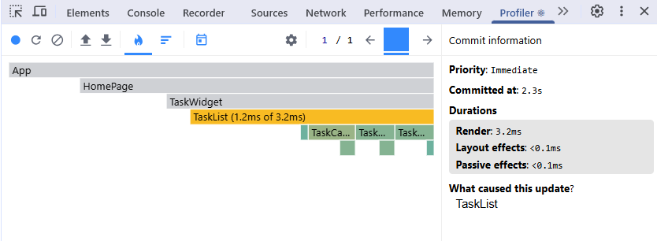
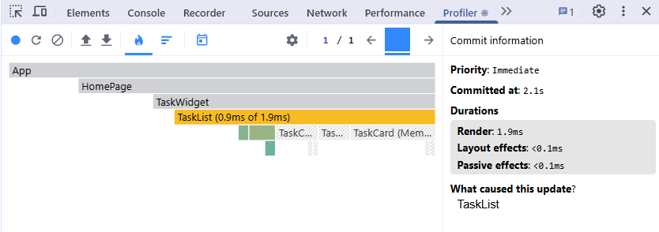

# HW 1

## DONE:

- Проект запускается без ошибок — 1 балл
- Структура соответствует FSD — 1 балл
- Настроены ESLint и Prettier с конфигурацией, отражающей принципы FSD — 1 балл
- Типизация и структура — 1 балл
- Компонент TaskCard с правильной презентационной логикой — 1 балл
- Стили через .module.css — 1 балл
- Хук useTasks корректно реализует фильтрацию и удаление — 1 балл
- Компонент TaskList правильно отображает отфильтрованные задачи — 1 балл
- Используется state-хук и проброс пропсов — 1 балл
- Страница и виджет работают корректно — 1 балл
- Читаемый, чистый и модульный код — 1 балл
- Вынести кнопку фильтрации в shared-компонент — 1 балл

# HW 2

## Работа с Profiler:

Удаление элемента списка до оптимизации:

Общее время рендера TaskList: 3.2 мс
Время рендера TaskList (активная часть): 1.2 мс
Количество перерисованных дочерних компонентов: Все TaskCard (зелёные блоки)

Удаление элемента списка после оптимизации:

Общее время рендера TaskList: 1.9 мс
Время рендера TaskList (активная часть): 0.9 мс
Количество перерисованных дочерних компонентов: Только один TaskCard (остальные заштрихованы как "Memo")

Вывод: Оптимизация позволила сократить время рендера и исключить ненужные перерисовки дочерних компонентов.

## DONE:

1. Оптимизация TaskCard с помощью React.memo

- Компонент TaskCard обернут в React.memo — 1 балл
- Поведение корректное, props не создаются заново — 1 балл
- Код читаемый и чистый — 1 балл

2. Мемоизация списка задач с useMemo

- useMemo применяется для фильтрации — 1 балл
- UI обновляется корректно — 1 балл
- Поведение не ломается — 1 балл

3. Мемоизация функций с useCallback

- Используется useCallback в useTasks — 1 балл
- Функции корректно передаются — 1 балл
- Поведение не ломается — 1 балл

Анализ производительности через DevTools

- Есть скриншот работы с Profiler — 1 балл
- Есть комментарии к скриншоту с пояснениями — 1 балл
- Есть анализ 2+ компонентов — 1 балл

# HW 3

## DONE:

- API корректно описан и экспортирует хук useGetTasksQuery — 1 балл
- Загрузка задач происходит без ошибок — 1 балл
- Используется transformResponse для получения массива — 1 балл
- Реализован хук useTasks,в котором данные загружаются через useGetTasksQuery — 1 балл;
- Задачи отображаются в интерфейсе — 1 балл
- Код структурирован и соответствует FSD — 1 балл
- Использован useEffect для загрузки данных в useState — 1 балл
- Реализована функция removeTask — 1 балл
- После удаления задача исчезает из UI — 1 балл
- baseApi создан и экспортирован из shared/api/baseApi.ts (или shares/...), tagTypes включает Tasks — 1 балл
- tasksApi использует injectEndpoints от baseApi; getTasks корректно возвращает Task[] — 1 балл
- в store подключены baseApi.reducer и baseApi.middleware один раз — 1 балл
